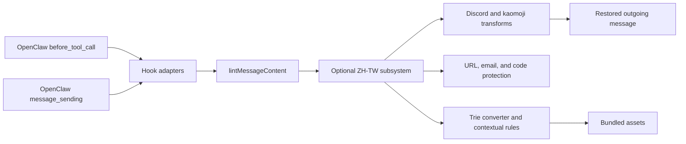

# Message Linter for OpenClaw

[](https://github.com/openclaw/openclaw)
[](https://opensource.org/licenses/MIT)

Message Linter is an OpenClaw plugin that normalizes outgoing messages immediately before dispatch. It provides Discord-oriented Markdown cleanup, kaomoji-safe backtick handling, and optional Simplified Chinese to Taiwan Traditional Chinese conversion without requiring an external OpenCC binary at runtime.

## What Problem Does It Solve?

Agent-generated messages can be valid text but still render poorly or change meaning when sent to Discord:

- Markdown links can trigger large automatic embeds.
- Deep headings, separators, blockquotes, and mixed bold/code syntax can render inconsistently.
- Kaomoji may contain backticks or accents that accidentally open Markdown code spans.
- Simplified Chinese conversion can corrupt URLs, email addresses, code, proper nouns, or ambiguous characters when applied without context.
- Different OpenClaw send paths can produce different output if each path formats messages independently.

Message Linter solves these problems at one boundary: the final outgoing-message path. Both supported OpenClaw hooks delegate to the same deterministic pipeline, protected regions are restored after transformation, and expensive ZH-TW assets are loaded only when that feature is enabled and needed.

## Features

- **Discord Markdown normalization**
  - Wraps Markdown link destinations in angle brackets to suppress Discord embeds.
  - Normalizes deep heading levels, standalone separators, blockquote spacing, Markdown tables, and mixed bold/code syntax.
- **Kaomoji-safe formatting**
  - Sanitizes backtick-like characters inside likely kaomoji tokens.
  - Preserves genuine inline code and fenced code blocks.
- **Optional Taiwan Traditional Chinese conversion**
  - Uses bundled OpenCC-derived phrase, character, and Taiwan variant data.
  - Applies only deterministic contextual spelling fixes automatically.
  - Provides opt-in case, punctuation, spacing, and quote normalization.
  - Protects raw URLs, internationalized URLs, email addresses, and Markdown code.
- **Shared hook behavior**
  - Uses one linter pipeline for tool-based sends and final message dispatch.
  - Returns no hook mutation when the normalized result is unchanged.

## Architecture

The package is intentionally layered so OpenClaw integration stays thin and text transforms remain independently testable.



| Layer                      | Main files                                               | Responsibility                                                                     |
| -------------------------- | -------------------------------------------------------- | ---------------------------------------------------------------------------------- |
| Plugin boundary            | `index.ts`, `api.ts`                                     | Define plugin metadata and isolate OpenClaw SDK imports.                           |
| Registration               | `src/plugin.ts`                                          | Parse plugin configuration and register hooks.                                     |
| Hook adapters              | `src/hooks.ts`                                           | Validate hook event shapes and delegate message text to the linter.                |
| Core pipeline              | `src/linter.ts`                                          | Resolve features and orchestrate transforms in a stable order.                     |
| Discord/kaomoji transforms | `src/transforms/discord.ts`, `src/transforms/kaomoji.ts` | Apply focused Markdown and token transformations.                                  |
| Markdown protection        | `src/utils/mask.ts`                                      | Mask and restore inline code and fenced code blocks.                               |
| ZH-TW subsystem            | `src/transforms/zhtw/`                                   | Lazy-load assets, convert text, protect structured tokens, and apply opt-in rules. |
| Data generation            | `scripts/generate-zhtw-data.mjs`                         | Fetch pinned sources, verify checksums, filter rules, and regenerate assets.       |

## How It Works

### Runtime flow

The plugin registers two hooks:

1. `before_tool_call` handles only `message` tool calls where `params.action === "send"` and `params.message` is a string.
2. `message_sending` handles final outgoing events where `content` is a string.
3. Both hooks call the same `lintMessageContent()` pipeline.
4. If normalization changes the text, the hook returns the updated message. Otherwise it returns `undefined`, leaving the original event untouched.

### Linter pipeline

`lintMessageContent()` applies transformations in this order:

1. Resolve feature flags using tolerant defaults.
2. Repair a single hallucinated leading backtick only when the first line remains unbalanced.
3. If ZH-TW is enabled and the message contains Han characters, run `convertZhTw()`.
4. Normalize Markdown tables and mixed bold/inline-code formatting when enabled.
5. Mask fenced code blocks and inline code spans.
6. Format Markdown links.
7. Replace standalone separators.
8. Sanitize kaomoji tokens.
9. Normalize Markdown headings.
10. Normalize blockquote spacing.
11. Restore masked Markdown code regions.

The ordering is part of the behavior. ZH-TW performs its own URL/email protection before the outer Markdown mask, while the outer mask prevents Discord and kaomoji transforms from rewriting code spans or fenced code blocks.

## ZH-TW Conversion

The Simplified-to-Traditional Chinese conversion feature is implemented entirely in native TypeScript and does not require an external OpenCC binary at runtime.

### Architecture

The conversion pipeline uses a trie-based longest-match phrase matcher with lazy initialization:

1. **Module singleton** — `ZhTwManager` owns the converter, spelling rules, case rules, and a cached initialization Promise. Assets are loaded on the first `convertZhTw()` call.
2. **Code-point trie matching** — phrase mappings are stored in a trie keyed by Unicode code point, so each input position walks only possible phrase prefixes instead of scanning every phrase. This also supports Han characters outside the Basic Multilingual Plane.
3. **Conservative single-character fallback** — when no phrase matches, the converter falls back to the character map. Fifteen genuinely ambiguous characters are excluded from unconditional fallback and are handled by phrase mappings instead.
4. **Protected zones** — phrase outputs are marked so Taiwan variant normalization does not overwrite phrase-level conversion results.
5. **Contextual spelling pass** — deterministic single-suggestion spelling rules are gated by context clues, negative context clues, positional clues, and exceptions before fixes are applied. Confusable rules require two distinct positive clues.
6. **Right-to-left fixes** — overlapping fixes are deduplicated, then applied from right to left to preserve offsets. Rules with zero or multiple suggestions are never applied automatically.

### Dictionary Data

Dictionary files are stored in `assets/` and loaded at runtime:

| File                         | Current entries | Description                                      |
| ---------------------------- | --------------: | ------------------------------------------------ |
| `assets/s2t-phrases.txt`     |          39,751 | OpenCC phrase mappings and ambiguity protections |
| `assets/s2t-chars.txt`       |           3,871 | Safe OpenCC single-character fallbacks           |
| `assets/s2t-tw-variants.txt` |              38 | OpenCC TWVariants-derived mappings               |
| `assets/spelling-rules.json` |           1,543 | Deterministic contextual spelling rules          |
| `assets/case-rules.json`     |              15 | Proper-noun case rules                           |
| `assets/zhtw-sources.json`   |               — | Pinned source commits, checksums, and counts     |

To update dictionaries from upstream, use the package script:

```bash
pnpm run generate:zhtw
```

The script fetches OpenCC dictionaries and the zhtw-mcp ruleset from commit-pinned URLs, filters deterministic auto-fix rules, imports case rules, and regenerates the `assets/` files. `assets/zhtw-sources.json` records the exact commits, source SHA-256 checksums, and generated counts; it intentionally omits a timestamp so repeated runs are byte-for-byte reproducible.

### Current ZH-TW Scope

The package currently implements the ZH-TW features that are safe for automatic outgoing-message normalization:

- Simplified Chinese to Taiwan Traditional Chinese conversion with OpenCC-derived phrase, character, and Taiwan variant assets.
- Contextual spelling auto-fixes from the deterministic, enabled, single-suggestion upstream subset. Multi-suggestion and political-coloring rules are not applied automatically.
- Opt-in proper-noun case fixes through `zhtw.case`.
- Opt-in punctuation normalization through `zhtw.punctuation`.
- Opt-in CJK/ASCII spacing normalization through `zhtw.spacing`.
- Opt-in Taiwan quote normalization through `zhtw.quotes`.
- Raw URL and email protection across the complete ZH-TW pipeline, including base S2T and spelling passes.
- Markdown inline code and fenced code protection through the shared linter masking pipeline.

The package intentionally remains an outgoing-message formatter. It mutates message text only when a feature flag enables a low-risk auto-fix path.

### Differences from zhtw-mcp

This plugin is inspired by zhtw-mcp, but it is not intended to be a full port of that server. The following zhtw-mcp capabilities are intentionally not implemented in this package:

- **Issue reporting and debug diagnostics** — zhtw-mcp can act like a text-processing server with issue reporting. This plugin runs inside OpenClaw message hooks, so it keeps the public behavior to formatting outgoing messages and does not expose a separate diagnostics API.
- **Review-only prose critique rules** — zhtw-mcp includes higher-level review categories such as AI filler, translationese, grammar, and repetition checks. Those rules are intentionally excluded because they are subjective and can easily change the user's tone. This plugin only performs deterministic, opt-in auto-fixes that are safe to apply before sending a message.

In short: this package keeps the automatic normalization subset and leaves subjective review or diagnostics workflows to dedicated review tools.

## Installation and Setup

This repository targets OpenClaw `2026.6.11`. The package entry is `./dist/index.js`, so a local checkout must be built before it is installed.

### Install from a local checkout

```bash
git clone https://github.com/ani6439walc/openclaw-plugin-message-linter.git
cd openclaw-plugin-message-linter
pnpm install
pnpm run build
openclaw plugins install --link .
openclaw plugins enable message-linter
```

If OpenClaw does not reload the plugin automatically, restart the Gateway:

```bash
openclaw gateway restart
```

Verify that OpenClaw loaded the runtime hooks:

```bash
openclaw plugins inspect message-linter --runtime --json
```

If the OpenClaw configuration uses a restrictive `plugins.allow` list, `message-linter` must be allowed before the plugin can load. OpenClaw normally updates an existing allowlist during an explicit plugin install.

## Configuration

OpenClaw stores plugin-specific configuration under `plugins.entries.<id>.config`. A complete configuration for this plugin looks like this:

```json
{
  "plugins": {
    "entries": {
      "message-linter": {
        "enabled": true,
        "config": {
          "features": {
            "zhtw": {
              "enabled": false,
              "case": false,
              "punctuation": false,
              "spacing": false,
              "quotes": false
            },
            "kaomoji": true,
            "discord": {
              "headings": true,
              "separators": true,
              "links": true,
              "blockquotes": true,
              "boldInlineCode": true
            }
          }
        }
      }
    }
  }
}
```

### Feature defaults

| Feature                  | Default | Effect                                                      |
| ------------------------ | ------: | ----------------------------------------------------------- |
| `zhtw.enabled`           | `false` | Enable S2T conversion and contextual spelling fixes.        |
| `zhtw.case`              | `false` | Apply proper-noun case rules.                               |
| `zhtw.punctuation`       | `false` | Normalize supported punctuation patterns.                   |
| `zhtw.spacing`           | `false` | Normalize CJK/ASCII spacing and repeated punctuation.       |
| `zhtw.quotes`            | `false` | Normalize paired quotes to Taiwan conventions.              |
| `kaomoji`                |  `true` | Protect kaomoji from accidental Markdown code parsing.      |
| `discord.headings`       |  `true` | Normalize deep Markdown heading levels.                     |
| `discord.separators`     |  `true` | Replace standalone separators with Discord-friendly output. |
| `discord.links`          |  `true` | Suppress Discord embeds for Markdown link destinations.     |
| `discord.blockquotes`    |  `true` | Normalize blockquote spacing.                               |
| `discord.boldInlineCode` |  `true` | Normalize Markdown tables and mixed bold/code syntax.       |

Configuration parsing is tolerant: invalid or missing feature values fall back to these defaults.

For backward compatibility, `"zhtw": true` and `"zhtw": false` are also accepted. Boolean `true` enables only S2T conversion and contextual spelling fixes; case, punctuation, spacing, and quote rules remain disabled until explicitly enabled with the object form.

## Development

### Local development setup

```bash
pnpm install
pnpm run typecheck
pnpm test
pnpm run build
```

The build always removes `dist/` before running `tsc`. This prevents deleted or renamed source files from leaving stale JavaScript or declaration files in the published package.

### Repository map

```text
.
├── index.ts                       # Plugin entry and public exports
├── api.ts                         # OpenClaw SDK boundary and logger
├── src/
│   ├── plugin.ts                  # Configuration and hook registration
│   ├── hooks.ts                   # OpenClaw hook adapters
│   ├── linter.ts                  # Shared transformation pipeline
│   ├── config.ts                  # Feature schema and defaults
│   ├── transforms/                # Discord, kaomoji, and ZH-TW transforms
│   └── utils/                     # Markdown and kaomoji helpers
├── assets/                        # Bundled ZH-TW runtime data
├── scripts/generate-zhtw-data.mjs # Reproducible data generator
├── openclaw.plugin.json           # Plugin metadata and config schema
└── *.test.ts / src/**/*.test.ts   # Vitest coverage
```

### Development workflow

1. Add or update a focused test beside the affected behavior.
2. Run the targeted test and confirm the expected failure.
3. Implement the smallest change in the relevant transform or adapter.
4. Preserve the linter ordering and protected-region invariants.
5. Run formatting and the full verification set before handoff.

```bash
pnpm run format
pnpm run typecheck
pnpm test
pnpm run build
pnpm pack --dry-run
```

### Where to add tests

| Change area                     | Primary tests                                                  |
| ------------------------------- | -------------------------------------------------------------- |
| Core pipeline/order             | `src/linter.test.ts`                                           |
| Discord formatting              | `src/transforms/discord.test.ts`                               |
| Kaomoji and Markdown masking    | `src/transforms/kaomoji.test.ts`, `src/utils/mask.test.ts`     |
| ZH-TW conversion                | `src/transforms/zhtw.test.ts`, `src/transforms/zhtw/*.test.ts` |
| Hook behavior                   | `src/hooks.test.ts`, `src/plugin.test.ts`                      |
| Manifest/config synchronization | `manifest.test.ts`, `src/config.test.ts`                       |
| Dictionary generation           | `generate-zhtw-data.test.ts`                                   |

### Package scripts

| Command                  | Description                                        |
| ------------------------ | -------------------------------------------------- |
| `pnpm run clean`         | Remove compiled output from `dist/`.               |
| `pnpm run typecheck`     | Type-check runtime sources without emitting files. |
| `pnpm test`              | Run the complete Vitest suite.                     |
| `pnpm run build`         | Clean `dist/`, then compile TypeScript.            |
| `pnpm run format`        | Format Markdown, JSON, TypeScript, and MJS files.  |
| `pnpm run generate:zhtw` | Regenerate bundled ZH-TW dictionary assets.        |

### Updating ZH-TW data

Run:

```bash
pnpm run generate:zhtw
```

The generator downloads commit-pinned OpenCC and zhtw-mcp sources, rejects redirects and checksum mismatches before parsing, and writes deterministic outputs. Review source changes and generate into a disposable directory before replacing repository assets. After accepting a data update, verify tests, package contents, generated counts, and `assets/zhtw-sources.json` together.

## Package and Release Model

The published package contains:

- `dist/` — compiled JavaScript, declarations, and source maps.
- `assets/` — bundled ZH-TW dictionaries, rules, and source provenance.
- `openclaw.plugin.json` — plugin metadata and configuration schema.
- `README.md`, `package.json`, and `LICENSE`.

Tests, generator scripts, TypeScript source files, and `vitest.config.*` are not published. Run `pnpm pack --dry-run` after build or packaging changes to verify the actual tarball inventory.

## Acknowledgments

The ZH-TW conversion feature was inspired by [zhtw-mcp](https://github.com/sysprog21/zhtw-mcp), a Rust-based text processing server for Traditional Chinese. The dictionary and contextual spelling-rule approach also builds on OpenCC dictionary data.

---

_🌸 Powered by Ani | [OpenClaw Plugin] © 2026_
